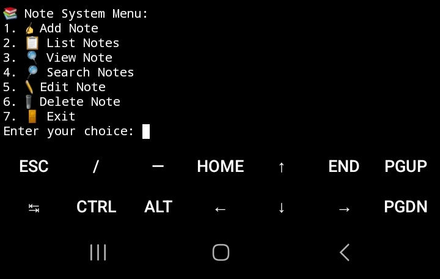

# Command-Line Note-Taking System

A feature-rich command-line note-taking system to help you stay organized and manage your notes effectively.



## Installation

1. **Clone the Repository:**

   ```bash
   git clone https://github.com/Poxlm/command-line-notes.git
   ```

2. **Navigate to the Project Directory:**

   ```bash
   cd command-line-notes
   ```

3. **Install Required Dependencies:**

   Ensure you have Python installed. Then, install the necessary dependencies.

   ```bash
   pip install -r requirements.txt
   ```

## Usage

1. **Run the Note-Taking System:**

   Start the note-taking system by running the following command:

   ```bash
   python notes.py
   ```

2. **Note System Menu:**

   - To add a new note, select option '1' and follow the prompts.
   - To list your notes, select option '2'.
   - To view a specific note, select option '3' and provide the note index.
   - To search for notes, select option '4' and enter your search query.
   - To edit a note, select option '5' and follow the prompts.
   - To delete a note, select option '6' and provide the note index.
   - To exit the system, select option '7'.

## Features

- 📝 Create, edit, and delete notes.
- 📋 List all your notes.
- 🔍 Search for notes by title or content.
- 📂 Organize notes into categories.
- 🕒 Track creation and last update timestamps.
- 📤 Automatically save and load notes for persistence.
- 🌈 User-friendly interface with emojis.

## Contribution

Contributions to this note-taking system are welcome! Here's how you can contribute:

1. **Fork the Repository:**

   Click the "Fork" button on the GitHub repository.

2. **Clone Your Fork:**

   ```bash
   git clone https://github.com/Poxlm/command-line-notes.git
   ```

3. **Create a New Branch:**

   ```bash
   git checkout -b feature/your-feature-name
   ```

4. **Make Changes:**

   Implement your desired feature or fix a bug.

5. **Commit Your Changes:**

   ```bash
   git commit -m "Add your commit message here"
   ```

6. **Push to Your Fork:**

   ```bash
   git push origin feature/your-feature-name
   ```

7. **Submit a Pull Request:**

   Go to the GitHub repository and create a pull request to the `main` branch.

## Upcoming Features

We have exciting plans for future enhancements, including:

- 📦 Export and import notes to/from a file.
- 🚀 Improved search and filtering options.
- 📅 Date-based note organization.
- 🌐 Synchronization across devices.
- 🌟 User customization options.

Stay tuned for updates and new features!

Thank you for using the Command-Line Note-Taking System! Enjoy organizing your notes effortlessly. 😊
